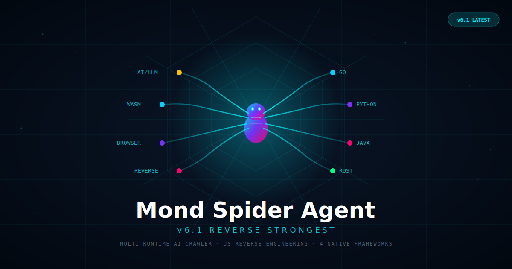

<p align="center">
  
</p>

<p align="center">
  
  
  
  
  
  
</p>

---

## What is Mond Spider Agent?

Mond Spider Agent is a **self-evolving AI crawler platform** that orchestrates 4 native spider frameworks (Go, Python, Java, Rust) through 18 intelligent subsystems. v6.1 upgrades the platform from a deep-evolution agent to a **complete reverse engineering platform** — capable of defeating JS obfuscation, tracing encrypted signature parameters, intercepting runtime crypto operations, and decompiling WASM modules, all automatically triggered when a crawl encounters anti-bot protections.

```
                    ┌─────────────────────────────────────────────┐
                    │        Mond Spider Agent  v6.1               │
                    │   SuperAgent — 18 AI Subsystems              │
                    └──────────────────────┬──────────────────────┘
                                           │
          ┌───────────┬───────────┬────────┼────────┬────────────┬────────────┐
          ▼           ▼           ▼        ▼        ▼            ▼            ▼
      GoSpider    PySpider   JavaSpider RustSpider  Apify   BrowserAgent  JS Reverse
       (Go)      (Python)     (Java)    (Rust)   (Actors)  (Playwright)   (MCP)
```

---

## Architecture Overview

### 4 Native Crawler Frameworks

| Framework | Language | Strengths | Key Features |
|-----------|----------|-----------|--------------|
| **GoSpider** | Go | Raw throughput, concurrency | goroutine-based parallelism, low memory, fast startup |
| **PySpider** | Python | Flexibility, ecosystem | Playwright/Scrapling/CloakBrowser integration, Node.js reverse bridge |
| **JavaSpider** | Java | Enterprise scale | Redis-backed scheduler, distributed worker pool, fault tolerance |
| **RustSpider** | Rust | Safety + speed | Zero-cost abstractions, memory-safe, built-in monitor center + API server |

Each framework runs as an independent subprocess, managed by a unified **Adapter Layer** that handles health checks, process lifecycle, and browser strategy fallback.

### Browser Strategy Fallback

When native crawlers encounter JavaScript-rendered pages, the adapter layer transparently falls back to headless browsers:

| Strategy | Engine | Use Case |
|----------|--------|----------|
| `playwright` | Chromium (Playwright) | General JS rendering, SPA crawling |
| `scrapling` | Scrapling + StealthFetcher | Anti-detection browser automation |
| `cloakbrowser` | CloakBrowser | Heavy anti-bot evasion (Cloudflare, DataDome) |
| `auto` | Auto-selected | AI picks the best strategy based on site fingerprint |

---

## 18 AI Subsystems

### Core Engines (v5.0 Hermes Foundation)

| # | Engine | Purpose |
|---|--------|---------|
| 1 | **AgenticLoop** | 6-phase execution cycle: Plan → Critic → Execute → Self-Heal → Evolve → Reflect |
| 2 | **KnowledgeGraph** | Entity-relation graph with automatic extraction, cross-crawl knowledge accumulation |
| 3 | **SmartCache** | Content fingerprinting + change detection + intelligent recrawl prediction |
| 4 | **MultiAgentCoordinator** | Coordinated swarm of specialized crawl agents with role-based task distribution |
| 5 | **AntiDetection** | Browser fingerprint rotation, human behavior simulation, risk scoring |
| 6 | **SelectorSynthesis** | Auto-generated + auto-healing CSS/XPath selectors with LLM-assisted repair |
| 7 | **StrategyEvolution** | Genetic-algorithm driven strategy optimization with A/B testing and fitness scoring |

### Beyond-Hermes Engines (v5.0+)

| # | Engine | Purpose |
|---|--------|---------|
| 8 | **Planner** | Multi-step goal decomposition and task planning |
| 9 | **Critic** | Output quality validation and self-critique |
| 10 | **RepairAgent** | Automatic failure diagnosis and self-healing |
| 11 | **ExperienceStore** | Persistent experience database for learning from past crawls |
| 12 | **MondAgent API** | High-level API for external integration and orchestration |

### Deep Evolution Engines (v6.0)

| # | Engine | Purpose |
|---|--------|---------|
| 13 | **WorldModel** | Causal reasoning about site architecture, anti-bot systems, rendering modes, API conventions, rate-limit behavior |
| 14 | **CuriosityEngine** | Proactive exploration of unknown sites to discover new patterns and transferable knowledge |
| 15 | **TransferLearning** | Cross-domain strategy migration based on site fingerprint similarity |
| 16 | **FreeCodeSynthesis** | LLM-driven arbitrary Python crawler module generation with AST validation and sandbox testing |
| 17 | **DeepMetacognition** | Capability gap analysis, learning plateau detection, self-critique generation |
| 18 | **AutonomousGoalSetter** | Self-directed goal generation for recursive self-improvement — creates the closed-loop evolution cycle |

### JS Reverse Engineering Engines (v6.1)

| # | Engine | Purpose |
|---|--------|---------|
| 19 | **ASTDeobfuscator** | 8 Babel AST passes for obfuscator.io / javascript-obfuscator deobfuscation |
| 20 | **HookEngine** | Runtime JS injection for intercepting crypto/network/storage/WASM calls |
| 21 | **SignatureTracer** | Taint analysis + program slicing for automatic signature parameter tracing |
| 22 | **WasmReverse** | Pure-Python WASM binary parser with decompilation and export analysis |
| 23 | **ReverseOrchestrator** | Unified dispatcher that selects and coordinates the optimal reverse pipeline |

---

## v6.1 Reverse Engineering — Deep Dive

### ASTDeobfuscator: 8 Babel Passes

Transforms heavily obfuscated JavaScript back into readable code using Babel AST transformations:

| Pass | Technique | What It Solves |
|------|-----------|----------------|
| **String Concat** | `"a" + "b"` → `"ab"` | Basic string splitting obfuscation |
| **Boolean If** | `if(true){...}` → `{...}` | Dead conditional branches |
| **Constant Fold** | `0xa + 0xb` → `21`, `!![]` → `true` | Constant expression obfuscation |
| **String Array** | `_0xabc[0x12]` → literal string | obfuscator.io string array encoding |
| **Dead Code** | Remove unreachable branches | `if(false){...}` and dead paths |
| **Identifier Rename** | `_0x1a2b3c` → semantic names | Hex-encoded identifier renaming via type inference |
| **Control Flow** | Flatten `switch` state machines | Control flow flattening (obfuscator.io high preset) |
| **Anti-Debug** | Strip `debugger` statements | Anti-debugging traps and infinite loops |

**Obfuscator Fingerprints Detected**: obfuscator.io, javascript-obfuscator, sojson, jsjiami, packer, and 7 more.

### HookEngine: Runtime Interception

Injects JavaScript hooks into Playwright/CloakBrowser pages to intercept critical API calls at runtime:

| Category | Intercepted APIs | Intelligence Gathered |
|----------|-----------------|----------------------|
| **Crypto** | `crypto.subtle.*`, `CryptoJS.*`, `forge.*` | Algorithm identification, key material, IV/nonce collection |
| **Network** | `fetch`, `XMLHttpRequest`, `axios` | Request signature parameter locations, header injection points |
| **Storage** | `localStorage`, `sessionStorage`, `cookie` | Token/state source identification |
| **Random** | `Math.random`, `crypto.getRandomValues` | Random seed tracing for reproducible signatures |
| **Time** | `Date.now`, `performance.now` | Timestamp dependency mapping |
| **DOM** | `document.querySelector*`, `getElementById` | DOM-dependent logic identification |
| **WASM** | `WebAssembly.instantiate*` | Automatic WASM module capture |

Each hook captures: timestamp, API name, arguments, return value, full stack trace, and execution context.

### SignatureTracer: Parameter Reverse Engineering

Automatically answers **"How is X-Sign / X-Bogus / signature generated?"** through a 5-stage pipeline:

```
1. Hook Point Identification    →  Find fetch()/XHR/axios call sites
2. Parameter Slicing            →  Backward slice from target param to all dependencies
3. Taint Analysis               →  Trace data flow: Date.now(), localStorage, Math.random() → sink
4. Generation Function Extract  →  Isolate the signing function, verify input→output equivalence
5. Python Translation           →  LLM-assisted JS→Python translation with verification tests
```

**Supported signature types**: X-Sign, X-Bogus, X-Khronos, X-Gorgon, X-Helios, X-Ladon, X-Argus, sign, signature, token, _signature, and arbitrary custom parameters.

### WasmReverse: WebAssembly Analysis

Pure-Python WASM binary parser (no external tools required) with full module analysis:

| Capability | Description |
|------------|-------------|
| **Binary Parsing** | LEB128 decoding, section parsing (type, import, function, export, code, data) |
| **Export Analysis** | Identifies exported functions with full type signatures |
| **String Extraction** | Recovers string literals from data sections |
| **Signature Detection** | Identifies likely crypto/signature functions via type heuristics + crypto evidence |
| **JS Wrapper Gen** | Generates JavaScript glue code for calling WASM exports from Node.js |

### ReverseOrchestrator: Unified Pipeline

Analyzes the target page and automatically selects the optimal reverse engineering strategy:

```
Page Analysis → Obfuscator Detection → Anti-Bot Classification
                    │                          │
                    ▼                          ▼
            ┌───────────────┐          ┌───────────────┐
            │ obfuscator.io │          │   Cloudflare  │
            │ js-obfuscator│          │   Akamai      │
            │ sojson       │          │   DataDome    │
            │ jsjiami      │          │   GeeTest     │
            └───────┬───────┘          └───────┬───────┘
                    │                          │
                    ▼                          ▼
         ASTDeobfuscator              HookEngine + Runtime
         (8 Babel passes)             Interception
                    │                          │
                    └──────────┬───────────────┘
                               ▼
                    SignatureTracer
                    (taint + slice → Python replay)
                               │
                               ▼
                    FreeCodeSynthesis
                    (register replay module for reuse)
```

**Anti-Bot Systems Detected**: Cloudflare, Akamai, DataDome, PerimeterX, GeeTest, and more.

---

## Super Run: The Intelligent Crawl Pipeline

`SuperAgent.super_run(url)` executes the full 8-stage pipeline:

```
Step 1: SmartCache Lookup
   │  → Cache hit? Return cached result with freshness check
   ▼
Step 2: StrategyEvolution Recommendation
   │  → Best strategy from genetic algorithm + historical fitness
   ▼
Step 3: WorldModel Prediction
   │  → Predict anti-bot type, rendering mode, API structure, rate limits
   ▼
Step 4: TransferLearning Strategy Migration
   │  → Reuse strategies from similar domains
   ▼
Step 5: AntiDetection Fingerprint + Proxy
   │  → Rotate browser fingerprint, inject human behavior patterns
   ▼
Step 6: AgenticLoop Execution
   │  → Plan → Critic → Execute → Self-Heal → Evolve → Reflect
   │
   ├── Step 6a: Failure? → RepairAgent auto-diagnosis
   ├── Step 6b: Still failing? → MultiAgentCoordinator swarm fallback
   └── Step 6c: 403/Blocked? → ReverseOrchestrator auto-trigger (v6.1)
              │
              ▼
         Reverse Pipeline → Python Replay Module → Retry with signatures
   │
   ▼
Step 7: KnowledgeGraph Update
   │  → Extract entities, update cross-crawl knowledge
   ▼
Step 8: Strategy Fitness Update + Evolution Cycle
   │  → Score strategy performance, trigger genetic evolution if needed
   ▼
Result: SuperRunResult (data, source, duration, cache_hit, strategy_used)
```

---

## Self-Evolution Loop

Mond Spider Agent is not just a crawler — it is a **self-improving system**:

```
┌──────────────────────────────────────────────────────────┐
│                 AutonomousGoalSetter                      │
│  Discovers capability gaps → generates exploration goals  │
└──────────────┬────────────────────────────┬──────────────┘
               │ proactive goals             │ passive tasks
               ▼                            ▼
┌────────────────────────┐     ┌──────────────────────────┐
│    CuriosityEngine     │     │      AgenticLoop         │
│  Explores unknown sites│     │  Plan→Critic→Execute→    │
│                        │     │  SelfHeal→Evolve→Reflect │
└────────────┬───────────┘     └────────────┬─────────────┘
             │ exploration results           │ task results
             ▼                              ▼
┌──────────────────────────────────────────────────────────┐
│                     WorldModel                            │
│  Causal model: site architecture, anti-bot, content      │
│  structure, API conventions, rate-limit behavior          │
└──────────────┬────────────────────────────┬──────────────┘
               │ causal predictions          │ domain model
               ▼                            ▼
┌──────────────────────────┐   ┌────────────────────────────┐
│   TransferLearning       │   │   DeepMetacognition         │
│  Cross-domain migration  │   │  "Why can't I learn X?"    │
└──────────────────────────┘   └────────────────────────────┘
               │                            │
               ▼                            ▼
┌──────────────────────────┐   ┌────────────────────────────┐
│  FreeCodeSynthesis       │   │  Feedback → GoalSetter     │
│  LLM generates new       │   │  (recursive improvement)   │
│  crawler modules         │   │                            │
└──────────────────────────┘   └────────────────────────────┘
```

---

## Benchmark Results

### v6.1 Reverse Engineering Tests — 23/23 Passed

| Test Suite | Tests | Status |
|------------|-------|--------|
| **ASTDeobfuscator** | 8 passes (string concat, boolean if, constant fold, string array, dead code, identifier rename, control flow, anti-debug) | **8/8** |
| **HookEngine** | Profile build, crypto analysis, network capture, event collection, chromium trace export, script generation, category filtering, stack trace capture, context metadata, multi-category | **10/10** |
| **SignatureTracer** | MD5 header signature, SHA256 query parameter, HMAC body signature | **3/3** |
| **WasmReverse** | Export analysis (3 WASM modules), string extraction, JS wrapper generation | **5/5** |

### Build Health

| Component | Check | Result |
|-----------|-------|--------|
| Go (gospider) | `go vet ./...` | Clean |
| Java (javaspider) | `mvn compile` | Clean |
| Rust (rustspider) | `cargo check` | Clean |
| Python (all modules) | 32/32 module imports | Clean |
| Benchmark | 23/23 tests | 100% |

---

## Technology Stack

| Layer | Technologies |
|-------|-------------|
| **Crawler Frameworks** | Go, Python, Java, Rust |
| **AI / LLM** | OpenAI API, local model support, LLM-driven code synthesis |
| **Browser Automation** | Playwright, Scrapling, CloakBrowser |
| **JS Reverse Engineering** | Babel AST (@babel/parser, @babel/traverse, @babel/generator), Node.js bridge |
| **WASM Analysis** | Pure-Python binary parser with LEB128 decoding |
| **Anti-Detection** | Fingerprint rotation, human behavior simulation, proxy integration |
| **Knowledge Systems** | Entity-relation graph, experience store, cross-domain transfer |
| **Evolution** | Genetic algorithm, fitness scoring, A/B testing, autonomous goal generation |
| **Deployment** | Docker, Kubernetes, standalone, Apify cloud actors |

---

## Project Structure

```
spider/
├── mond_agent/              # AI SuperAgent (Python) — 18 subsystems
│   ├── super_agent.py       # Main orchestrator: super_run() pipeline
│   ├── agentic_loop.py      # 6-phase Plan→Execute→Evolve cycle
│   ├── knowledge_graph.py   # Entity-relation knowledge accumulation
│   ├── smart_cache.py       # Intelligent result caching
│   ├── multi_agent.py       # Swarm coordination
│   ├── anti_detection.py    # Fingerprint + behavior management
│   ├── selector_synthesis.py # Auto CSS/XPath generation
│   ├── strategy_evolution.py # Genetic algorithm optimization
│   ├── world_model.py       # Causal site modeling
│   ├── curiosity_engine.py  # Proactive exploration
│   ├── transfer_learning.py # Cross-domain migration
│   ├── free_code_synthesis.py # LLM code generation
│   ├── deep_metacognition.py # Self-analysis
│   ├── autonomous_goals.py  # Self-directed goals
│   └── adapters/            # Framework adapters (Go/Python/Java/Rust/Apify)
│
├── js_reverse_mcp/          # JS Reverse Engineering MCP Server
│   ├── ast_deobfuscator.py  # 8 Babel AST passes
│   ├── hook_engine.py       # Runtime JS hook injection
│   ├── signature_tracer.py  # Taint + slice signature tracing
│   ├── wasm_reverse.py      # WASM binary analysis
│   ├── orchestrator.py      # Unified reverse dispatcher
│   ├── reverse_engine.py    # Legacy obfuscator detection
│   └── benchmark/           # 23 benchmark tests
│
├── gospider/                # Go crawler framework
├── pyspider/                # Python crawler framework
│   └── node_reverse/        # Node.js reverse bridge
├── javaspider/              # Java crawler framework
├── rustspider/              # Rust crawler framework
│
├── config/                  # Configuration files
├── deploy/                  # Deployment configs (Docker, K8s, enterprise)
├── examples/                # Usage examples and presets
└── docs/                    # Documentation and assets
```

---

## Key Differentiators

### vs. Traditional Crawlers (Scrapy, Puppeteer, Selenium)

| Capability | Traditional | Mond Spider Agent |
|------------|------------|-------------------|
| Multi-framework | Single runtime | 4 native frameworks + Apify actors |
| Anti-bot handling | Manual configuration | Auto-detection + auto-evasion |
| JS reverse engineering | None | 8 AST passes + hook engine + WASM |
| Signature tracing | Manual reverse | Automatic taint + slice analysis |
| Self-improvement | None | 18 AI subsystems with evolution loop |
| Cross-domain learning | None | Automatic strategy transfer |
| Code synthesis | None | LLM generates new crawler modules |
| Knowledge accumulation | Per-session | Persistent graph across all crawls |

### vs. AI Crawlers (Crawl4AI, Firecrawl, Jina)

| Capability | AI Crawlers | Mond Spider Agent |
|------------|------------|-------------------|
| Framework diversity | Usually 1 runtime | Go + Python + Java + Rust |
| Reverse engineering | LLM-only | AST + Hook + Taint + WASM pipeline |
| Obfuscation handling | Prompt-based | 8 deterministic Babel passes |
| Runtime interception | None | 7-category hook engine |
| WASM support | None | Binary parser + decompiler |
| Evolution | Fine-tuning | Genetic algorithm + metacognition |
| Autonomous goals | None | Self-directed exploration |

---

## Version History

| Version | Codename | Key Additions |
|---------|----------|---------------|
| v1.0 | Foundation | Basic Go/Python/Java/Rust crawlers |
| v2.0 | Hermes | AgenticLoop, KnowledgeGraph, SmartCache |
| v3.0 | Evolution | StrategyEvolution, AntiDetection, SelectorSynthesis |
| v4.0 | Swarm | MultiAgentCoordinator, ExperienceStore |
| v5.0 | Deep Hermes | Planner, Critic, RepairAgent, MondAgent API |
| v6.0 | Deep Evolution | WorldModel, CuriosityEngine, TransferLearning, FreeCodeSynthesis, DeepMetacognition, AutonomousGoalSetter |
| **v6.1** | **Reverse Strongest** | **ASTDeobfuscator (8 passes), HookEngine (7 categories), SignatureTracer, WasmReverse, ReverseOrchestrator** |

---

## License

MIT License. See [LICENSE](LICENSE) for details.

---

<p align="center">
  <sub>Built with Go, Python, Java, Rust, Node.js, Babel, Playwright, and a lot of AI.</sub>
</p>
