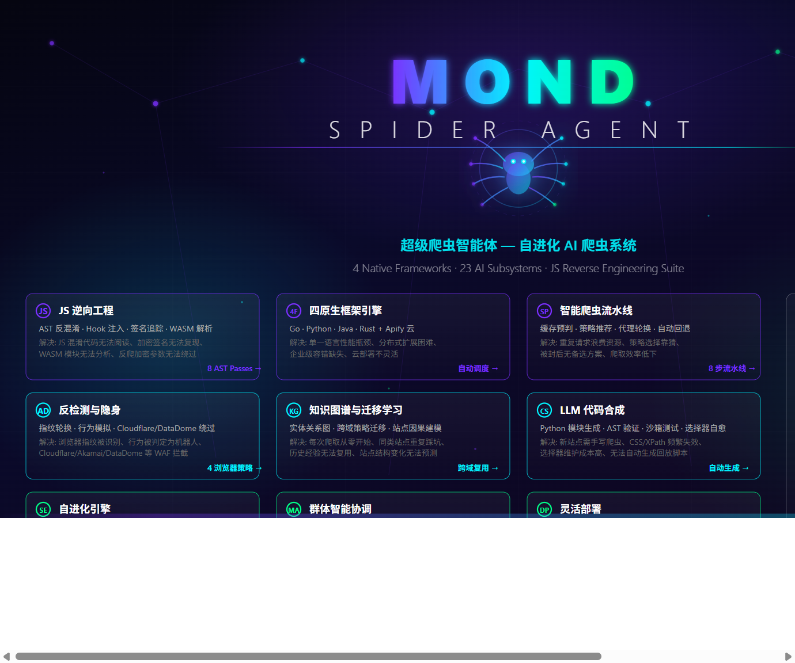

<p align="center">
  
</p>

<p align="center">
  
  
  
  
  
</p>

---

## What is Mond Spider Agent?

A **self-evolving AI crawler platform** that orchestrates **4 native frameworks** (Go, Python, Java, Rust) through **23 intelligent subsystems** and a full **JS reverse engineering suite** — capable of defeating obfuscation, tracing encrypted signatures, intercepting runtime crypto, and decompiling WASM modules, all triggered automatically.

```
                    ┌─────────────────────────────────────────┐
                    │         Mond Spider Agent               │
                    │    SuperAgent — 23 AI Subsystems        │
                    └──────────────────────┬──────────────────┘
                                           │
          ┌───────────┬───────────┬────────┼────────┬────────────┬────────────┐
          ▼           ▼           ▼        ▼        ▼            ▼            ▼
      GoSpider    PySpider   JavaSpider RustSpider  Apify   BrowserAgent  JS Reverse
       (Go)      (Python)     (Java)    (Rust)   (Actors)  (Playwright)   (MCP)
```

---

## Why Mond Spider Agent?

### vs. Traditional Crawlers (Scrapy, Puppeteer, Selenium)

| Capability | Traditional | Mond Spider Agent |
|------------|------------|-------------------|
| Multi-framework | Single runtime | 4 native frameworks + Apify actors |
| Anti-bot handling | Manual configuration | Auto-detection + auto-evasion |
| JS reverse engineering | None | 8 AST passes + hook engine + WASM |
| Signature tracing | Manual reverse | Automatic taint + slice analysis |
| Self-improvement | None | 23 AI subsystems with evolution loop |
| Cross-domain learning | None | Automatic strategy transfer |
| Code synthesis | None | LLM generates new crawler modules |
| Knowledge accumulation | Per-session | Persistent graph across all crawls |

### vs. AI Crawlers (Crawl4AI, Firecrawl, Jina)

| Capability | AI Crawlers | Mond Spider Agent |
|------------|------------|-------------------|
| Framework diversity | Usually 1 runtime | Go + Python + Java + Rust |
| Reverse engineering | LLM-only | AST + Hook + Taint + WASM pipeline |
| Obfuscation handling | Prompt-based | 8 deterministic Babel passes |
| Runtime interception | None | 7-category hook engine |
| WASM support | None | Binary parser + decompiler |
| Evolution | Fine-tuning | Genetic algorithm + metacognition |
| Autonomous goals | None | Self-directed exploration |

---

## Quick Start

```bash
# 1. Clone the repository
git clone https://github.com/Lyx3314844-03/mond-spider-agent.git
cd mond-spider-agent/spider

# 2. Install dependencies
pip install -r requirements.txt
cd js_reverse_mcp && npm install && cd ..

# 3. Configure API key
export OPENAI_API_KEY="sk-xxx"   # or use local model via config/

# 4. Run
python -m mond_agent.super_agent --url "https://target-site.com"

# 5. Run with full reverse engineering pipeline
python -m mond_agent.super_agent --url "https://target-site.com" --reverse auto
```

<details>
<summary>Framework-specific usage</summary>

```bash
# GoSpider — high-throughput crawling
cd gospider && go run main.go --url "https://target-site.com"

# JavaSpider — distributed crawling with Redis scheduler
cd javaspider && mvn exec:java -Dexec.mainClass="com.mond.Spider"

# RustSpider — memory-safe high-performance crawling
cd rustspider && cargo run -- --url "https://target-site.com"

# Apify Cloud Actors
python -m mond_agent.super_agent --url "https://target-site.com" --engine apify
```

</details>

---

## Architecture Overview

### 4 Native Crawler Frameworks

| Framework | Language | Strengths | Key Features |
|-----------|----------|-----------|--------------|
| **GoSpider** | Go | Raw throughput, concurrency | goroutine-based parallelism, low memory, fast startup |
| **PySpider** | Python | Flexibility, ecosystem | Playwright/Scrapling/CloakBrowser, Node.js reverse bridge |
| **JavaSpider** | Java | Enterprise scale | Redis-backed scheduler, distributed worker pool, fault tolerance |
| **RustSpider** | Rust | Safety + speed | Zero-cost abstractions, memory-safe, monitor center + API server |

Each framework runs as an independent subprocess, managed by a unified **Adapter Layer** that handles health checks, process lifecycle, and browser strategy fallback.

### Browser Strategy Fallback

When native crawlers encounter JS-rendered pages, the adapter layer transparently falls back to headless browsers:

| Strategy | Engine | Use Case |
|----------|--------|----------|
| `playwright` | Chromium (Playwright) | General JS rendering, SPA crawling |
| `scrapling` | Scrapling + StealthFetcher | Anti-detection browser automation |
| `cloakbrowser` | CloakBrowser | Heavy anti-bot evasion (Cloudflare, DataDome) |
| `auto` | AI-selected | Picks the best strategy based on site fingerprint |

---

## 23 AI Subsystems

### Core — Crawl Execution & Intelligence

> The foundation that every crawl depends on.

| Engine | What It Does |
|--------|-------------|
| **AgenticLoop** | 6-phase cycle: Plan → Critic → Execute → Self-Heal → Evolve → Reflect |
| **KnowledgeGraph** | Entity-relation graph, cross-crawl knowledge accumulation |
| **SmartCache** | Content fingerprinting + change detection + predictive recrawl |
| **SelectorSynthesis** | Auto-generated CSS/XPath selectors with LLM-assisted repair |
| **AntiDetection** | Fingerprint rotation, human behavior simulation, risk scoring |

### Coordination — Multi-Agent Swarm

> Multiple specialized agents working together.

| Engine | What It Does |
|--------|-------------|
| **MultiAgentCoordinator** | Role-based task distribution across crawl agent swarm |
| **Planner** | Multi-step goal decomposition and task planning |
| **Critic** | Output quality validation and self-critique |
| **RepairAgent** | Automatic failure diagnosis and self-healing |

### Evolution — Self-Improvement

> The system gets smarter over time.

| Engine | What It Does |
|--------|-------------|
| **StrategyEvolution** | Genetic-algorithm driven optimization with A/B testing |
| **ExperienceStore** | Persistent experience database from past crawls |
| **WorldModel** | Causal reasoning about site architecture, anti-bot, API conventions |
| **CuriosityEngine** | Proactive exploration of unknown sites for new patterns |
| **TransferLearning** | Cross-domain strategy migration via fingerprint similarity |
| **DeepMetacognition** | Capability gap analysis, learning plateau detection |
| **AutonomousGoalSetter** | Self-directed goal generation for recursive improvement |
| **FreeCodeSynthesis** | LLM-driven Python module generation with AST validation + sandbox |

### Reverse Engineering — JS Anti-Bot Defeat

> Automatically triggered when crawl encounters protection.

| Engine | What It Does |
|--------|-------------|
| **ASTDeobfuscator** | 8 Babel AST passes to deobfuscate JS |
| **HookEngine** | 7-category runtime interception (crypto/network/storage/random/time/DOM/WASM) |
| **SignatureTracer** | Taint analysis + program slicing → auto Python replay |
| **WasmReverse** | Pure-Python WASM binary parser + decompiler + JS wrapper gen |
| **ReverseOrchestrator** | Unified dispatcher selecting optimal reverse pipeline |

### Integration

| Engine | What It Does |
|--------|-------------|
| **MondAgent API** | High-level API for external integration and orchestration |

---

## Super Run: The Intelligent Crawl Pipeline

`SuperAgent.super_run(url)` executes the full 8-stage pipeline:

```
Step 1: SmartCache Lookup          → Cache hit? Return cached result
Step 2: StrategyEvolution           → Best strategy from genetic algorithm
Step 3: WorldModel Prediction       → Predict anti-bot, rendering mode, rate limits
Step 4: TransferLearning            → Reuse strategies from similar domains
Step 5: AntiDetection               → Rotate fingerprint, inject human behavior
Step 6: AgenticLoop Execution       → Plan → Critic → Execute → Self-Heal → Evolve → Reflect
        ├── 6a: Failure?            → RepairAgent auto-diagnosis
        ├── 6b: Still failing?      → MultiAgentCoordinator swarm fallback
        └── 6c: 403/Blocked?        → ReverseOrchestrator auto-trigger
Step 7: KnowledgeGraph Update       → Extract entities, update cross-crawl knowledge
Step 8: Strategy Fitness + Evolution → Score performance, trigger genetic evolution
```

---

## Self-Evolution Loop

Mond Spider Agent is not just a crawler — it is a **self-improving system**:

```
┌──────────────────────────────────────────────────────────┐
│                 AutonomousGoalSetter                      │
│  Discovers capability gaps → generates exploration goals  │
└──────────────┬────────────────────────────┬──────────────┘
               │ proactive goals             │ passive tasks
               ▼                            ▼
┌────────────────────────┐     ┌──────────────────────────┐
│    CuriosityEngine     │     │      AgenticLoop         │
│  Explores unknown sites│     │  Plan→Critic→Execute→    │
│                        │     │  SelfHeal→Evolve→Reflect │
└────────────┬───────────┘     └────────────┬─────────────┘
             │ exploration results           │ task results
             ▼                              ▼
┌──────────────────────────────────────────────────────────┐
│                     WorldModel                            │
│  Causal model: site architecture, anti-bot, API          │
│  conventions, rate-limit behavior                        │
└──────────────┬────────────────────────────┬──────────────┘
               │ causal predictions          │ domain model
               ▼                            ▼
┌──────────────────────────┐   ┌────────────────────────────┐
│   TransferLearning       │   │   DeepMetacognition         │
│  Cross-domain migration  │   │  "Why can't I learn X?"    │
└──────────────────────────┘   └────────────────────────────┘
               │                            │
               ▼                            ▼
┌──────────────────────────┐   ┌────────────────────────────┐
│  FreeCodeSynthesis       │   │  Feedback → GoalSetter     │
│  LLM generates new       │   │  (recursive improvement)   │
│  crawler modules         │   │                            │
└──────────────────────────┘   └────────────────────────────┘
```

---

## Reverse Engineering — Deep Dive

### ASTDeobfuscator: 8 Babel Passes

| Pass | Technique | What It Solves |
|------|-----------|----------------|
| **String Concat** | `"a" + "b"` → `"ab"` | String splitting obfuscation |
| **Boolean If** | `if(true){...}` → `{...}` | Dead conditional branches |
| **Constant Fold** | `0xa + 0xb` → `21`, `!![]` → `true` | Constant expression obfuscation |
| **String Array** | `_0xabc[0x12]` → literal string | obfuscator.io string array encoding |
| **Dead Code** | Remove unreachable branches | `if(false){...}` and dead paths |
| **Identifier Rename** | `_0x1a2b3c` → semantic names | Hex-encoded identifier renaming |
| **Control Flow** | Flatten `switch` state machines | Control flow flattening |
| **Anti-Debug** | Strip `debugger` statements | Anti-debugging traps |

**Obfuscator Fingerprints Detected**: obfuscator.io, javascript-obfuscator, sojson, jsjiami, packer, and 7 more.

### HookEngine: Runtime Interception

| Category | Intercepted APIs | Intelligence |
|----------|-----------------|--------------|
| **Crypto** | `crypto.subtle.*`, `CryptoJS.*`, `forge.*` | Algorithm, key material, IV/nonce |
| **Network** | `fetch`, `XMLHttpRequest`, `axios` | Signature param locations, header injection |
| **Storage** | `localStorage`, `sessionStorage`, `cookie` | Token/state source identification |
| **Random** | `Math.random`, `crypto.getRandomValues` | Random seed tracing |
| **Time** | `Date.now`, `performance.now` | Timestamp dependency mapping |
| **DOM** | `document.querySelector*`, `getElementById` | DOM-dependent logic identification |
| **WASM** | `WebAssembly.instantiate*` | Automatic WASM module capture |

### SignatureTracer: 5-Stage Pipeline

```
1. Hook Point Identification    →  Find fetch()/XHR/axios call sites
2. Parameter Slicing            →  Backward slice from target param
3. Taint Analysis               →  Trace data flow to sink
4. Generation Function Extract  →  Isolate signing function
5. Python Translation           →  LLM-assisted JS→Python with verification
```

**Supported**: X-Sign, X-Bogus, X-Khronos, X-Gorgon, X-Helios, X-Ladon, X-Argus, sign, signature, token, and arbitrary custom parameters.

### WasmReverse: WebAssembly Analysis

| Capability | Description |
|------------|-------------|
| **Binary Parsing** | LEB128 decoding, full section parsing |
| **Export Analysis** | Exported functions with type signatures |
| **String Extraction** | String literal recovery from data sections |
| **Signature Detection** | Crypto/signature function heuristics |
| **JS Wrapper Gen** | JavaScript glue code for Node.js WASM calls |

### ReverseOrchestrator: Unified Pipeline

```
Page Analysis → Obfuscator Detection → Anti-Bot Classification
                    │                          │
                    ▼                          ▼
            ┌───────────────┐          ┌───────────────┐
            │ obfuscator.io │          │   Cloudflare  │
            │ js-obfuscator │          │   Akamai      │
            │ sojson        │          │   DataDome    │
            └───────┬───────┘          └───────┬───────┘
                    │                          │
                    ▼                          ▼
         ASTDeobfuscator              HookEngine + Runtime
         (8 Babel passes)             Interception
                    │                          │
                    └──────────┬───────────────┘
                               ▼
                    SignatureTracer
                    (taint + slice → Python replay)
                               │
                               ▼
                    FreeCodeSynthesis
                    (register replay module for reuse)
```

---

## Benchmark — 23/23 Passed

| Test Suite | Tests | Status |
|------------|-------|--------|
| **ASTDeobfuscator** | string concat, boolean if, constant fold, string array, dead code, identifier rename, control flow, anti-debug | **8/8** |
| **HookEngine** | profile build, crypto, network, events, trace export, script gen, category filter, stack trace, context metadata, multi-category | **10/10** |
| **SignatureTracer** | MD5 header, SHA256 query, HMAC body | **3/3** |
| **WasmReverse** | export analysis (3 modules), string extraction, JS wrapper gen | **5/5** |

| Component | Check | Result |
|-----------|-------|--------|
| Go (gospider) | `go vet ./...` | Clean |
| Java (javaspider) | `mvn compile` | Clean |
| Rust (rustspider) | `cargo check` | Clean |
| Python (all modules) | 32/32 imports | Clean |

---

## Technology Stack

| Layer | Technologies |
|-------|-------------|
| **Crawler Frameworks** | Go, Python, Java, Rust |
| **AI / LLM** | OpenAI API, local model support, LLM-driven code synthesis |
| **Browser Automation** | Playwright, Scrapling, CloakBrowser |
| **JS Reverse Engineering** | Babel AST, Node.js bridge |
| **WASM Analysis** | Pure-Python binary parser with LEB128 decoding |
| **Anti-Detection** | Fingerprint rotation, human behavior simulation, proxy |
| **Knowledge Systems** | Entity-relation graph, experience store, cross-domain transfer |
| **Evolution** | Genetic algorithm, fitness scoring, A/B testing, autonomous goals |
| **Deployment** | Docker, Kubernetes, standalone, Apify cloud actors |

---

## Project Structure

```
spider/
├── mond_agent/                    # ← AI SuperAgent — the brain
│   ├── super_agent.py             #   Entry point: super_run() orchestrates everything
│   ├── agentic_loop.py            #   Core execution cycle
│   ├── knowledge_graph.py         #   Cross-crawl knowledge
│   ├── smart_cache.py             #   Intelligent caching
│   ├── multi_agent.py             #   Swarm coordination
│   ├── anti_detection.py          #   Fingerprint + behavior
│   ├── selector_synthesis.py      #   Auto CSS/XPath
│   ├── strategy_evolution.py      #   Genetic algorithm
│   ├── world_model.py             #   Causal site modeling
│   ├── curiosity_engine.py        #   Proactive exploration
│   ├── transfer_learning.py       #   Cross-domain migration
│   ├── free_code_synthesis.py     #   LLM code generation
│   ├── deep_metacognition.py      #   Self-analysis
│   ├── autonomous_goals.py        #   Self-directed goals
│   └── adapters/                  #   ← calls the 4 frameworks below
│       ├── go_adapter.py          #     ──→ gospider/
│       ├── py_adapter.py          #     ──→ pyspider/
│       ├── java_adapter.py        #     ──→ javaspider/
│       ├── rust_adapter.py        #     ──→ rustspider/
│       └── apify_adapter.py       #     ──→ Apify cloud
│
├── js_reverse_mcp/                # ← JS Reverse Engineering — triggered by adapters
│   ├── ast_deobfuscator.py        #   8 Babel AST passes
│   ├── hook_engine.py             #   Runtime JS hook injection
│   ├── signature_tracer.py        #   Taint + slice tracing
│   ├── wasm_reverse.py            #   WASM binary analysis
│   ├── orchestrator.py            #   ← called by mond_agent when 403/blocked
│   └── benchmark/                 #   23 benchmark tests
│
├── gospider/                      # Go crawler (called by go_adapter)
├── pyspider/                      # Python crawler (called by py_adapter)
│   └── node_reverse/              #   Node.js reverse bridge
├── javaspider/                    # Java crawler (called by java_adapter)
├── rustspider/                    # Rust crawler (called by rust_adapter)
│
├── config/                        # API keys, engine selection, browser strategy
├── deploy/                        # Docker, K8s, Apify deployment configs
├── examples/                      # Usage examples and presets
└── docs/                          # Documentation and assets
```

**Call flow**: `super_agent.py` → `adapters/` → framework subprocess → on 403/blocked → `js_reverse_mcp/orchestrator.py` → reverse pipeline → `free_code_synthesis.py` (generate replay module)

---

## Contact / 联系方式

<p align="center">
  
  
</p>

<table align="center">
<tr>
<td align="center">

**微信 WeChat**: `3314844`

</td>
</tr>
</table>

---

## License

MIT License. See [LICENSE](LICENSE) for details.

---

<p align="center">
  <sub>Built with Go, Python, Java, Rust, Node.js, Babel, Playwright, and a lot of AI.</sub>
</p>
